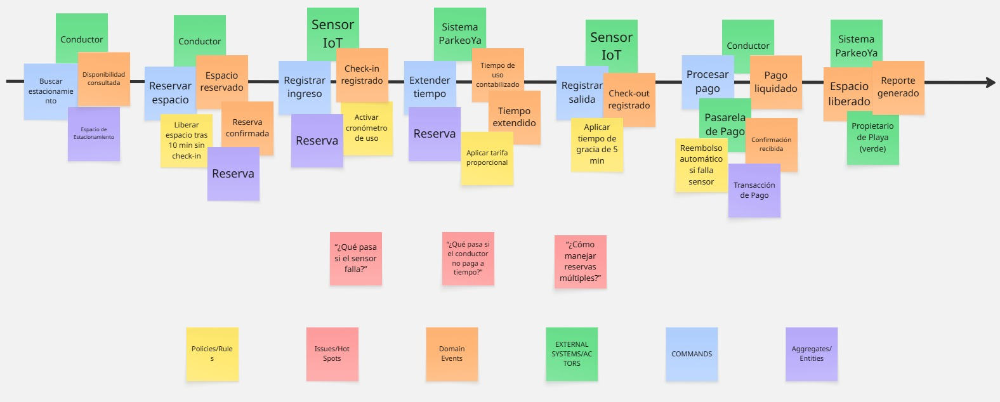

## Capítulo IV: Requirements Specification

### 4.1. Strategic-Level Domain-Driven Design

En esta sección presentamos el proceso y las decisiones estratégicas aplicando Domain-Driven Design (DDD) al proyecto ParkeoYa. El objetivo fue descomponer el dominio en Bounded Contexts bien delimitados, definiendo cómo colaboran entre sí para resolver los casos de negocio más relevantes (búsqueda, reserva, uso del espacio, pago y monitoreo IoT).

El trabajo se estructuró en cuatro actividades principales:

1. EventStorming (Design-Level)
2. Candidate Context Discovery
3. Domain Message Flows Modeling (Domain Storytelling)
4. Bounded Context Canvases (iterativos) 

> **Herramienta utilizada:** Miro (tablero “ParkeoYa – DDD”), con sticky notes naranjas (eventos), azules (comandos), rosas (actores), amarillas (políticas) y moradas (agregados).  
> **Duración total:** 3.5 h (1h45m EventStorming + 1h30m Candidate Context Discovery + 15m Domain Storytelling inicial + 15m cierre).  
> **Participantes:** Todo el equipo (conductores/propietarios representados por el Product Owner) y un facilitador DDD.

---

#### 4.1.1 Design Level EventStorming

##### Propósito y alcance
El objetivo de la sesión de **EventStorming** fue mapear los **eventos de dominio** clave de punta a punta (descubrimiento → reserva → ingreso/salida → pago → liberación → analítica), identificar políticas/decisiones y detectar *pivotal events* que anticipan límites naturales entre contextos.

##### Actividades realizadas
- **Warm-up (10 min):** repaso de ubiquitous language (estacionamiento, reserva, check-in, check-out, tiempo de gracia, tarifa, sensor).  
- **Storming (70 min):** construcción de la línea de tiempo con eventos de negocio; se añadieron comandos, actores y políticas.  
- **Refactor (25 min):** agrupación de eventos por zonas de responsabilidad y detección de dependencias externas (pasarela de pagos, push notifications).  

##### Línea de tiempo (eventos principales)
1. Conductor busca estacionamiento.  
2. Disponibilidad consultada (datos de sensores agregados).  
3. Espacio reservado (bloqueo temporal).  
4. Reserva confirmada (reglas de overbooking y tiempo de gracia).  
5. Conductor llega → Check-in registrado (sensor detecta ocupación).  
6. Uso del espacio contabilizado (cronómetro de tarifa).  
7. Extensión de tiempo solicitada (opcional).  
8. Check-out registrado (libera el espacio).  
9. Pago liquidado (cobro exacto por tiempo).  
10. Reembolso/ajuste aplicado (si aplica).  
11. Ocupación/rotación actualizadas.  
12. Métricas y reportes generados (dashboard propietario).  
13. Alertas operativas (ocupación no autorizada, sensor caído).  

##### Políticas de negocio detectadas

- **Bloqueo de espacio:** al crear reserva se bloquea por *X* minutos hasta el check-in.  
- **Tiempo de gracia:** tolerancia configurable antes de liberar y penalizar.  
- **Cálculo de tarifa:** redondeo mixto (hora + prorrateo minutos).  
- **Compensación por falla:** reembolso automático y crédito si el sensor se equivoca.  
- **SLA de sensores:** batería/conectividad bajo umbral → alerta preventiva.  

##### 4.1.1.1. Candidate Context Discovery

##### 4.1.1.2. Domain Message Flows Modeling

##### 4.1.1.3. Bounded Context Canvases

#### 4.1.2 Context Mapping

#### 4.1.3. Software Architecture

##### 4.1.3.1. Software Architecture Context Level Diagrams

##### 4.1.3.2. Software Architecture Container Level Diagrams

##### 4.1.3.3. Software Architecture Deployment Diagrams

### 4.2. Tactical-Level Domain-Driven Design

#### 4.2.X. Bounded Context: <Bounded Context Name>

##### 4.2.X.1. Domain Layer

##### 4.2.X.2. Interface Layer

##### 4.2.X.3. Application Layer

##### 4.2.X.4. Infrastructure Layer

##### 4.2.X.5. Bounded Context Software Architecture Component Level Diagrams

##### 4.2.X.6. Bounded Context Software Architecture Code Level Diagrams

###### 4.2.X.6.1. Bounded Context Domain Layer Class Diagrams

###### 4.2.X.6.2. Bounded Context Database Design Diagram